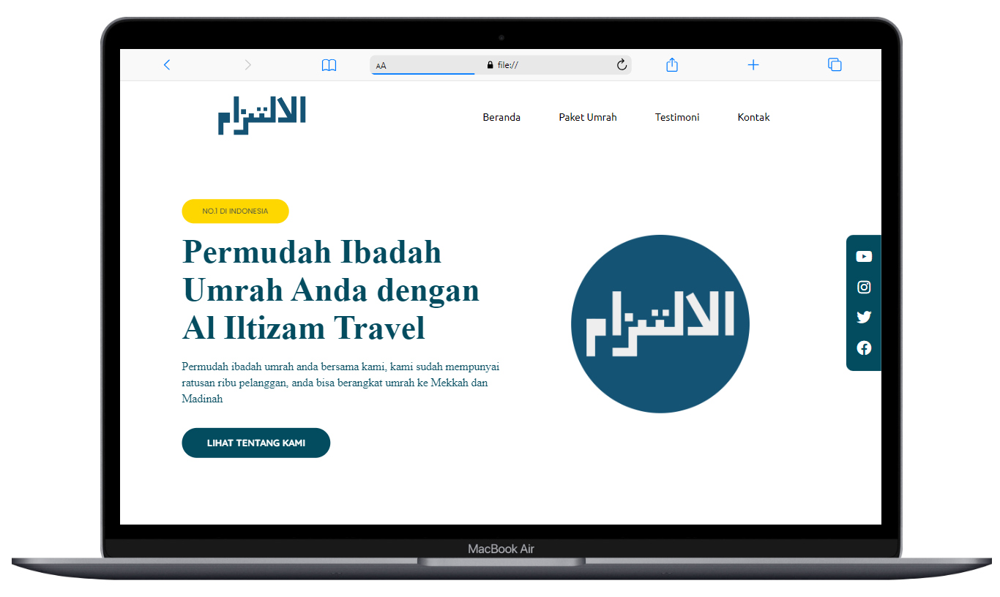
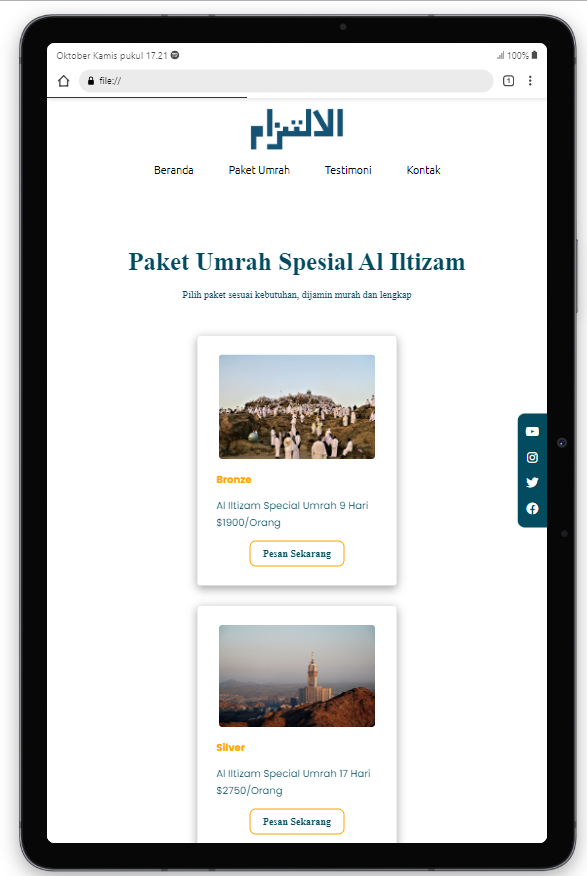
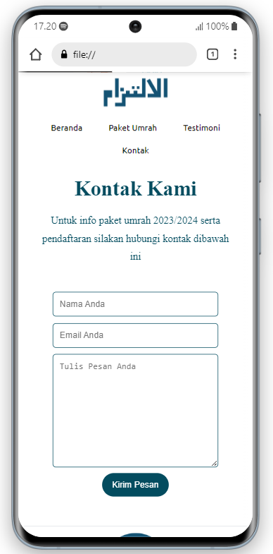

# Submission Belajar Dasar Pemrograman Web - Dicoding


Ini adalah repositori untuk submission kursus "Belajar Dasar Pemrograman Web" dari Dicoding. Pada kursus ini, saya telah belajar tentang dasar HTML,
penerapan elemen semantic, menerapkan styling menggunakan CSS dan layouting menggunakan flexbox. Saya juga telah mengerjakan beberapa proyek tugas untuk menguji pemahaman saya.

### Preview

| Tampilan Laptop |
| ----------------------------------------- |
|  |

| Tampilan Tablet  | Tampilan Handphone |
| ------------------------------------------ | ----------------------------------------- |
|  |  |

## Kriteria Submission
- Terdapat elemen  ```<header> ``` ,  ```<footer>```,  ```<main>```,  ```<article>```, dan  ```<aside>``` di berkas HTML.
Masing-masing elemen wajib berisi konten yang peruntukkannya sesuai dengan elemen tersebut (menerapkan konsep semantic HTML dalam menyusun struktur website).
Contohnya:
- Tidak terdapat duplikasi elemen ```<main>```.
- Elemen <main> harus berada diantara ```<header>``` dan ```<footer>```.
- Harus terdapat elemen <header> sebelum <main> dan <footer> sesudah ```<main>```.
- Jika terdapat elemen <header> atau <footer> di dalam elemen ```<article>``` atau ```<aside>```, maka hal tersebut diperbolehkan.
- Wajib menampilkan menampilkan foto di elemen ```<aside>```. Anda boleh menampilkan foto diri Anda sekaligus menampilkan biodata lainnya atau Anda juga bisa menampilkan foto yang relevan dengan konten yang Anda tulis.
- Menyusun layout menggunakan flexbox, bukan float.
- Tema yang ditampilkan bebas, kecuali tema Bandung.
- Semakin detail dan lengkap website Anda maka nilai submission akan makin tinggi.

## Cara Menjalankan Proyek

Anda dapat menjalankan proyek-proyek ini dengan mengikuti langkah-langkah berikut:

1. Klon repositori ini ke komputer Anda:

   ```bash
   git clone https://github.com/esaepulloh/Dicoding-Dasar-Pemrograman-Web.git
